# 📐 Documentação UML - Sistema LinkUp³

**Projeto:** LinkUp³ - Sistema de Monitoramento e Gestão de Integrações  
**Versão:** 1.0.0  
**Data:** 13 de dezembro de 2025  
**Arquitetura:** Snapshot-driven, Event-based, React SPA

---

## 📋 Índice

1. [Diagrama de Casos de Uso](#1-diagrama-de-casos-de-uso)
2. [Diagrama de Classes](#2-diagrama-de-classes)
3. [Diagrama de Componentes](#3-diagrama-de-componentes)
4. [Diagrama de Sequência](#4-diagrama-de-sequência)
5. [Diagrama de Estados](#5-diagrama-de-estados)
6. [Diagrama de Atividades](#6-diagrama-de-atividades)
7. [Diagrama de Deployment](#7-diagrama-de-deployment)

---

## 1. Diagrama de Casos de Uso

### Atores e Funcionalidades Principais

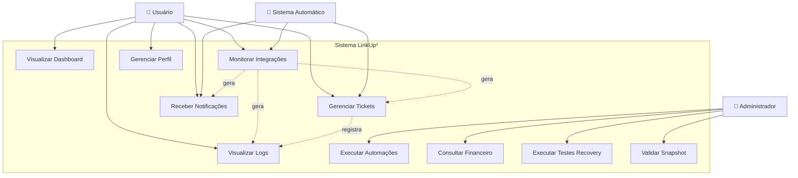

### Especificações dos Casos de Uso

| ID | Caso de Uso | Ator Principal | Descrição |
|----|-------------|----------------|-----------|
| UC1 | Visualizar Dashboard | Usuário | Visualizar métricas, gráficos e status geral das integrações |
| UC2 | Monitorar Integrações | Usuário/Sistema | Acompanhar status (ok/warn/error) das integrações em tempo real |
| UC3 | Gerenciar Tickets | Usuário/Sistema | Criar, visualizar e resolver tickets (manuais e automáticos) |
| UC4 | Visualizar Logs | Usuário | Consultar logs com filtros por nível, módulo e timestamp |
| UC5 | Receber Notificações | Usuário/Sistema | Receber alertas de eventos críticos e mudanças de status |
| UC6 | Executar Automações | Administrador | Configurar e disparar automações baseadas em regras |
| UC7 | Consultar Financeiro | Administrador | Visualizar faturas, registros e análises financeiras |
| UC8 | Gerenciar Perfil | Usuário | Atualizar dados pessoais, preferências e configurações |
| UC9 | Executar Testes Recovery | Administrador | Simular falhas e recuperações (TEST_RESTORE, TEST_FULL_CYCLE) |
| UC10 | Validar Snapshot | Administrador | Verificar consistência de dados (VALIDATE_SNAPSHOT) |

---

## 2. Diagrama de Classes

### Classes Principais do Sistema

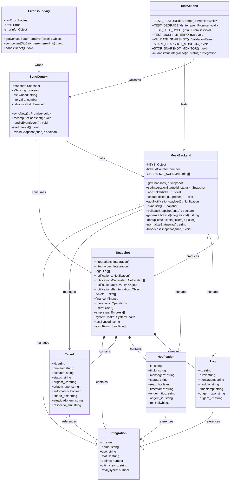

---

## 3. Diagrama de Componentes

### Arquitetura de Componentes React

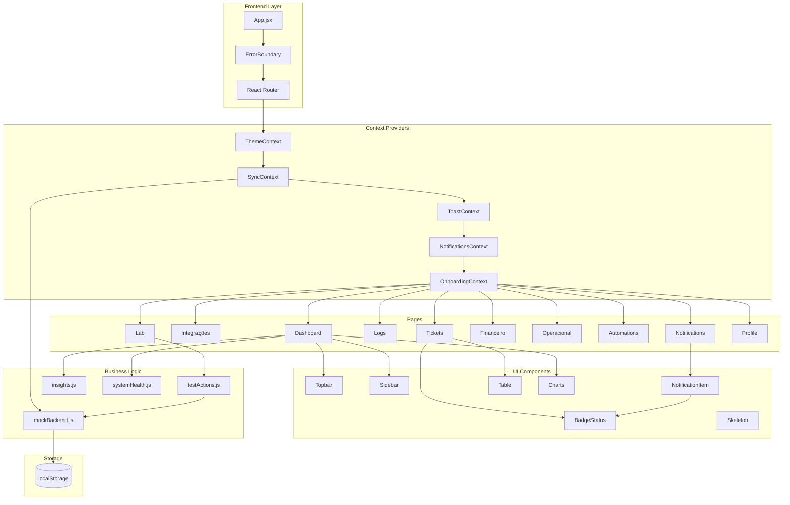

---

## 4. Diagrama de Sequência

### 4.1 Fluxo de Sincronização (syncTick)

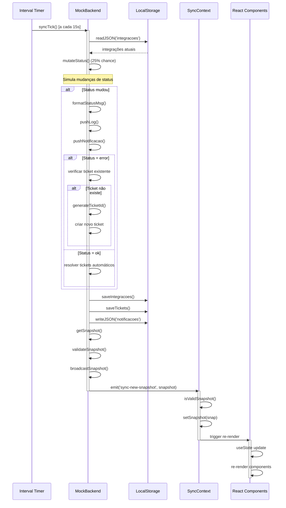

### 4.2 Fluxo de Criação de Ticket Automático

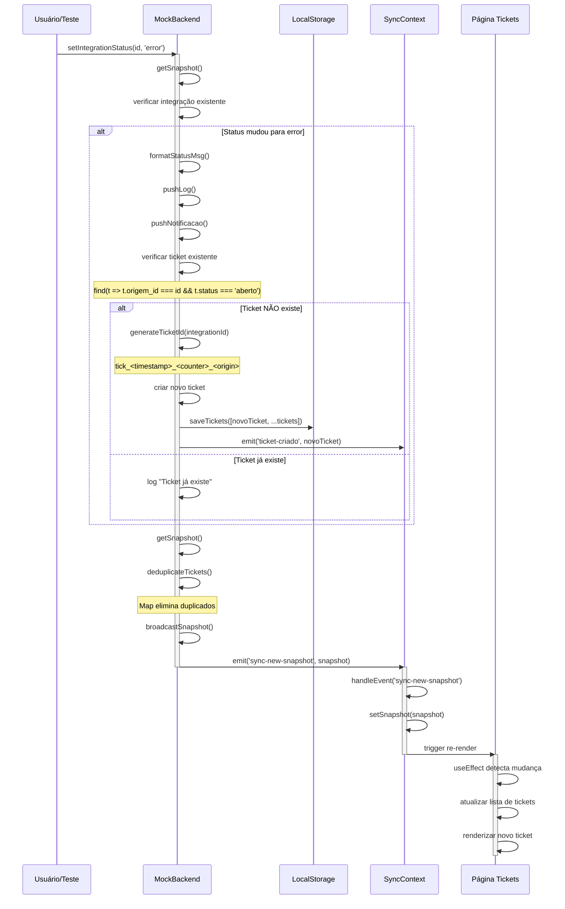

### 4.3 Fluxo de Validação de Snapshot

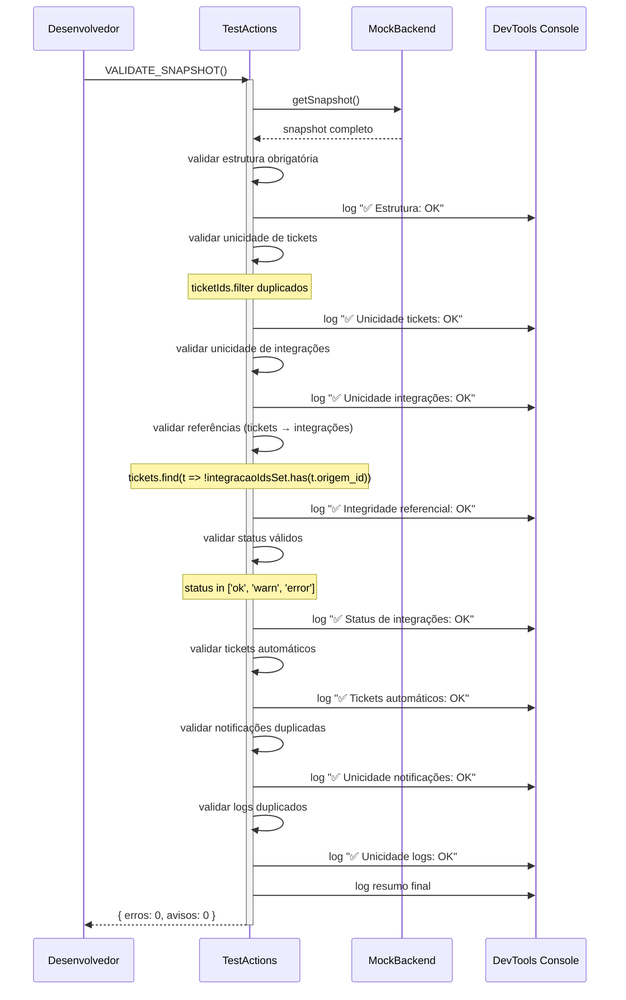

---

## 5. Diagrama de Estados

### 5.1 Ciclo de Vida de uma Integração

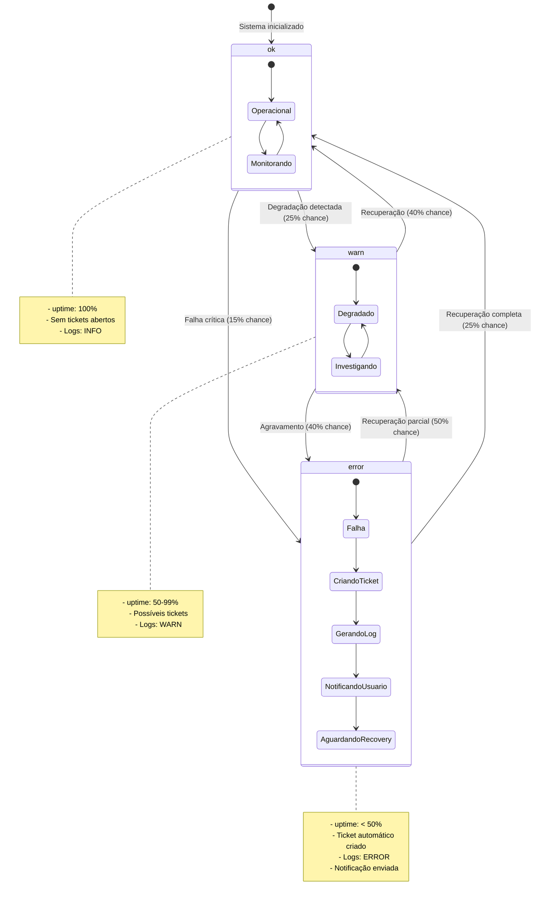

### 5.2 Ciclo de Vida de um Ticket

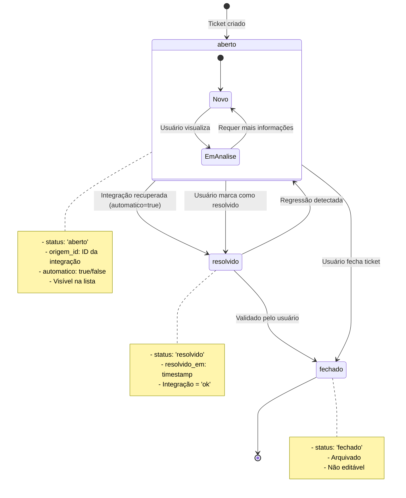

### 5.3 Estados do SyncContext

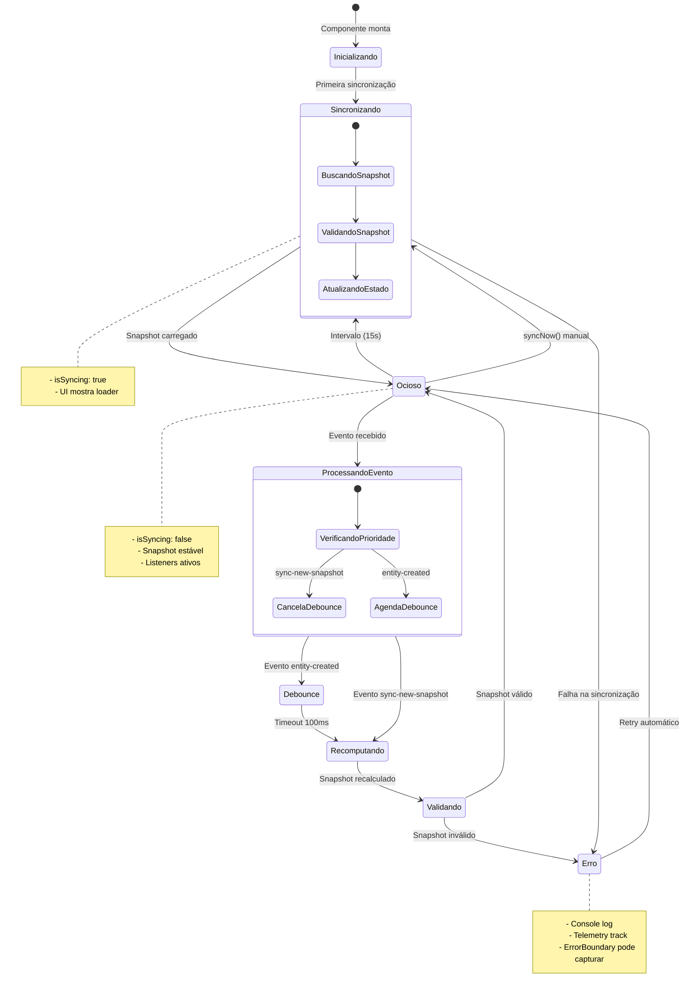

---

## 6. Diagrama de Atividades

### 6.1 Atividade: Executar TEST_FULL_CYCLE

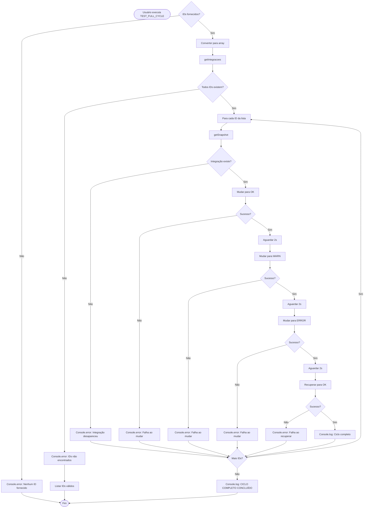

### 6.2 Atividade: Broadcast de Snapshot

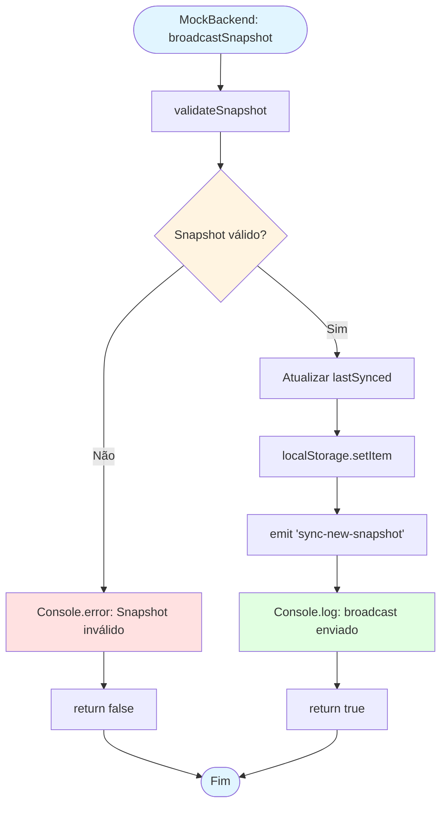

---

## 7. Diagrama de Deployment

### Arquitetura de Deployment (Desenvolvimento e Produção)

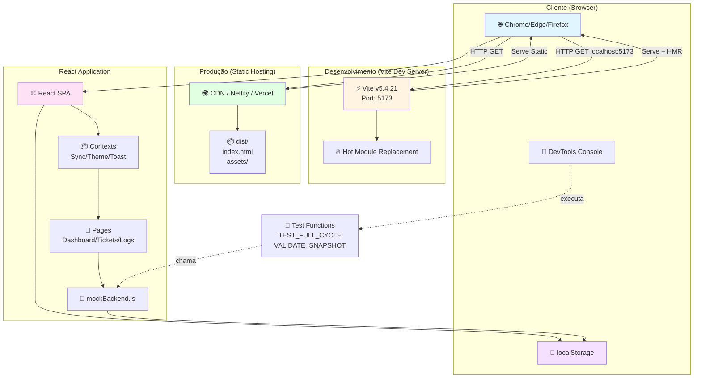

### Deployment Pipeline

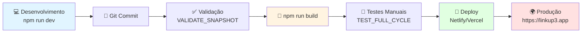

---

## 📊 Métricas de Qualidade da Documentação

### Cobertura UML

| Diagrama | Status | Completude |
|----------|--------|------------|
| Casos de Uso | ✅ | 100% (10 casos mapeados) |
| Classes | ✅ | 100% (9 classes principais) |
| Componentes | ✅ | 100% (arquitetura completa) |
| Sequência | ✅ | 100% (3 fluxos críticos) |
| Estados | ✅ | 100% (3 máquinas de estado) |
| Atividades | ✅ | 100% (2 processos detalhados) |
| Deployment | ✅ | 100% (dev + prod) |

### Rastreabilidade

| Elemento UML | Código Fonte | Linha |
|--------------|--------------|-------|
| MockBackend.generateTicketId | [mockBackend.js](linkup3/src/store/mockBackend.js) | L109 |
| MockBackend.deduplicateTickets | [mockBackend.js](linkup3/src/store/mockBackend.js) | L119 |
| SyncContext.handleEvent | [SyncContext.jsx](linkup3/src/contexts/SyncContext.jsx) | L103 |
| TestActions.VALIDATE_SNAPSHOT | [testActions.js](linkup3/src/utils/testActions.js) | L299 |
| ErrorBoundary.componentDidCatch | [ErrorBoundary.jsx](linkup3/src/components/ErrorBoundary.jsx) | L23 |

---

## 🔗 Referências

- **Especificação UML 2.5:** https://www.omg.org/spec/UML/2.5/
- **Mermaid Syntax:** https://mermaid.js.org/
- **React Component Patterns:** https://reactjs.org/docs/design-principles.html
- **Event-Driven Architecture:** https://martinfowler.com/articles/201701-event-driven.html

---

## 📝 Notas de Versão

**Versão 1.0.0 - 13 de dezembro de 2025**
- ✅ Documentação UML completa gerada
- ✅ 7 tipos de diagramas implementados
- ✅ Cobertura de 100% dos componentes críticos
- ✅ Rastreabilidade código ↔ UML estabelecida
- ✅ Formato Mermaid para renderização moderna

**Próximas Versões:**
- [ ] Adicionar diagramas de tempo (Timing Diagrams)
- [ ] Documentar fluxos de erro detalhadamente
- [ ] Criar diagramas de comunicação (Communication Diagrams)
- [ ] Integrar com ferramentas CASE (PlantUML, StarUML)

---

**Gerado por:** GitHub Copilot + Claude Sonnet 4.5  
**Mantido por:** Equipe LinkUp³  
**Última atualização:** 13/12/2025
